## 骄阳电机开发板

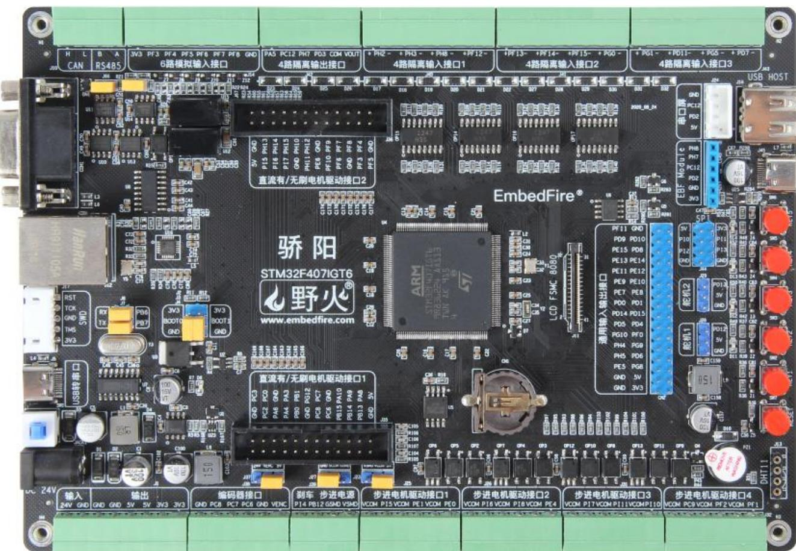

硬件规格书 

Rev. 1.0.0 

## 销售与服务联系

## 东莞野火电子有限公司

地址：东莞市大岭山镇石大路2号艺华综合办公大楼 301 1 2 3 4楼 

官网：https://embedfire.com 

论坛：http://www.firebbs.cn 

资料：https://doc.embedfire.com 

天猫：https://yehuosm.tmall.com 

京东：https://yehuo.jd.com/ 

邮箱：embedfire@embedfire.com 

电话：0769-33894118 

## 扫码获得更多精彩

野火百科

野火电子

野火天猫店

野火京东店

野火抖音号

野火视频号

野火B站号

野火小师妹

## 技术支持与售后服务

## 1. 资料内容

1. 所有产品的信息与资料可从《销售与服务联系》节中的官网、店铺、资料页获取。 

2. 产品所提供的资料以商品详情页、资料下载页、资料下载实际内容等为准，若有疑问请咨询销售。 

3. 对于未提供、非开源、有变更的资料内容，若有疑问请通过资料内容说明或咨询销售确认，否则 不予以保证。 

## 2. 技术支持范围

1. 提供对例程的运行流程与现象的解释。 

2. 对用户修改例程、额外编写、例程源码之外的内容提供有限的讨论范围。 

3. 提供对硬件资源的解释。 

4. 对开源原理图部分提供有限的讨论范围，不作硬件修改指导。 

## 3. 售后与保修

1. 产品退换货服务政策以购买所在店铺的服务条款为准。 

2. 对于在售产品提供长久维修服务，除焊盘脱落、严重损坏等无法维修情况外可以联系购买所在店 铺寄回检修。注：主芯片损坏不在免费保修范围内，具体请咨询店铺。 

## 免责声明

东莞野火电子有限公司（以下简称：“野火”）保留在任何时候与不事先声明的情况下对野火产 品与文档更改、修正、补充的权利。用户可在野火资料主页 https://doc.embedfire.com/ 或者联系客 服与售后获取最新信息。 

用户使用开发板等产品过程请遵守本文档内容，因为使用环境不当或制作产品因设计未考虑周 全导致的损失需要自行承担。 

## 手册版本

<table><tr><td>手册版本</td><td>日期</td><td>更新说明</td></tr><tr><td>V 1.0.0</td><td></td><td>• 初始版本</td></tr><tr><td></td><td></td><td></td></tr><tr><td></td><td></td><td></td></tr></table>

## 目 录

销售与服务联系....-1-
技术支持与售后服务....-2-
1.资料内容....-2-
2.技术支持范围....-2-
3.售后与保修....-2-
免责声明....-3-
手册版本....-4-
目录....-6-
第一章 STM32F407IGT6 芯片简介....-8-
第二章 骄阳电机开发板硬件资源介绍....-10-
2.1 电机开发板外观图....-10-
2.2 电机开发板尺寸图....-10-
2.3 电机开发板硬件规格....-11-
2.4 骄阳电机开发板硬件详细说明....-13-
2.4.1 电源输入和电源输出....-13-
2.4.2 电源开关....-13-
2.4.3 编码器输入接口....-14-
2.4.4 直流有刷/无刷电机驱动接口....-14-
2.4.5 刹车输入，步进电源输出接口....-15-
2.4.6 SPI FLASH....-16-
2.4.7 RTC 供电纽扣电池座....-16-
2.4.8 4 路隔离步进电机驱动接口....-16-
2.4.9 MCU 屏幕接口....-17-
2.4.10 蜂鸣器....-18-
2.4.11 DHT11/DS18B20 接口....-19-
2.4.12 按键....-20-
2.4.13 引出 IO....-20-
2.4.14 2 路舵机接口....-21-
2.4.15 SPI 接口....-22-
2.4.16 USB Device....-22-
2.4.17 EBF 模块接口....-23-
2.4.18 USB HOST....-23-
2.4.19 串口屏接口....-23-
2.4.20 EEPROM....-24-
2.4.21 3×4 路隔离输入接口....-25-
2.4.22 4 路隔离输出接口....-26- 

2.4.23 6 路模拟输入接口 ..... 27 -
2.4.24 1 路带隔离 485 接口 ..... 27 -
2.4.25 1 路带隔离 CAN 接口 ..... 27 -
2.4.26 1 路 RS232 接口(母) ..... 28 -
2.4.27 STM32F407 主控芯片 ..... 29 -
2.4.28 以太网接口 ..... 29 -
2.4.29 SWD 接口 ..... 29 -
2.4.30 USB 转串口(非下载) ..... 30 -
2.5 开发板底板使用说明 ..... 31 -
2.5.1 引脚指南 ..... 31 -
2.5.2 具体常用芯片位置图 ..... 32 -
2.5.3 关于隔离输入输出口的使用 ..... 33 - 

## 第一章 STM32F407IGT6 芯片简介

野火 STM32F407 骄阳电机开发板采用的是意法半导体公司的 STM32F407IGT6 芯片作为主控芯片。 

STM32F407IGT6 是一款基于高性能 ARM Cortex-M4 32 位 RISC 内核，工作频率高达 168 MHz， 带有单精准度浮点运算单元，支持所有 ARM 单精准度数据处理指令与数据类型。它还允许执行全套 DSP 指令，以及包含 1 个用于增强应用程序安全性的内存保护单元。它采用高速嵌入式存储器（Flash 高达 1 MB，SRAM高达 192 KB、备份 SRAM 高达 4 KB），以及多种增强型 I/O 与外设，连接至 2 条 APB 总线，3 条 AHB 总线与 1 个 32 位多 AHB 总线阵列。该设备提供 3 个 12 位模数转换器，2 个数模 转换器，1个低功率 RTC与 12个通用 16位计时器，2个通用 32位计时器，1个真随机数发生器，并具 有标准与高级通讯接口。其主要参数如下图： 

<table><tr><td colspan="2">详细参数</td></tr><tr><td>CPU</td><td>• Arm® Cortex®-M4</td></tr><tr><td>Package</td><td>• LQFP176</td></tr><tr><td>Max Speed (MHz)</td><td>• 168</td></tr><tr><td>Flash (Bytes)</td><td>• 1024K</td></tr><tr><td>SRAM (Bytes)</td><td>• 192K+4K</td></tr><tr><td>I/O</td><td>• 140</td></tr><tr><td>TIM (32bit)</td><td>• 2</td></tr><tr><td>TIM (16bit)</td><td>• 12</td></tr><tr><td>WDG</td><td>• 2</td></tr><tr><td>RTC</td><td>• 1</td></tr><tr><td>USART/UART</td><td>• 4/2</td></tr><tr><td>I2C</td><td>• 3</td></tr><tr><td>SPI</td><td>• 3</td></tr><tr><td>CAN</td><td>• 2</td></tr><tr><td>I2S</td><td>• 2</td></tr><tr><td>USB</td><td>• 2</td></tr><tr><td>FSMC</td><td>• 1</td></tr><tr><td>SDIO</td><td>• 1</td></tr><tr><td>Ethernet</td><td>• 1</td></tr><tr><td>ADC(12bit)</td><td>• 3</td></tr><tr><td>DAC(12bit)</td><td>• 2</td></tr><tr><td>Random number generator</td><td>• 1</td></tr><tr><td>Camera interface</td><td>• 1</td></tr></table>

## 第二章 骄阳电机开发板硬件资源介绍

## 2.1 电机开发板外观图

图 2.1-1 骄阳电机开发板正面视图

## 2.2 电机开发板尺寸图

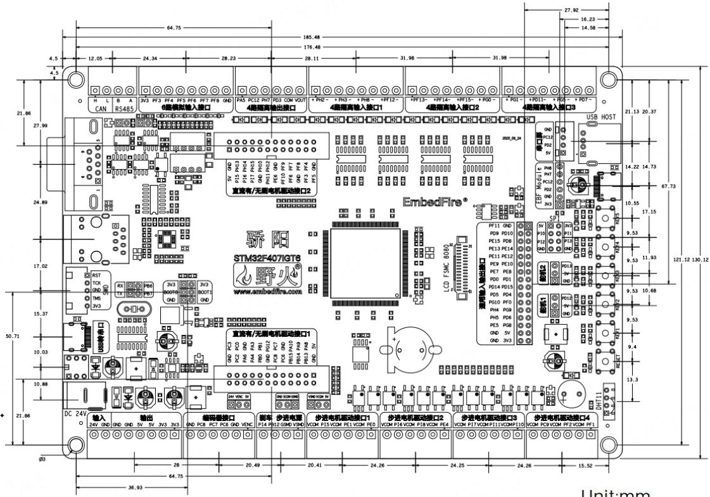

图 2.2-1 骄阳电机开发板正面机械尺寸图

## 2.3 电机开发板硬件规格

<table><tr><td colspan="2">骄阳电机开发板硬件规格</td></tr><tr><td>尺寸</td><td>185.48*130.12MM</td></tr><tr><td>PCB</td><td>2层、黑色沉金</td></tr><tr><td>主芯片</td><td>STM32F407IGT6,封装:LQFP176</td></tr><tr><td>晶振</td><td>25MHz</td></tr><tr><td>FLASH</td><td>W25Q128,容量128Mbit</td></tr><tr><td>EEPROM</td><td>AT24C02,容量:2Kbit</td></tr><tr><td>电源输入</td><td>DC 12V@1A直流输入,支持电脑USB供电</td></tr><tr><td>KEY</td><td>RESET 1个,用户机械按键5个</td></tr><tr><td>LED灯</td><td>4个</td></tr><tr><td>USB转串口</td><td>1个,使用Type-c接口</td></tr><tr><td>485</td><td>1路带隔离485接口</td></tr><tr><td>CAN</td><td>1路带隔离can接口</td></tr><tr><td>模拟输入</td><td>6路模拟输入接口</td></tr><tr><td>232</td><td>1路母头DB9</td></tr><tr><td>EBF接口</td><td>1个,使用1*6P 2.54间隔排母引出</td></tr><tr><td>以太网</td><td>1路百兆以太网,PHY芯片型号LAN8720A</td></tr><tr><td>SWD接口</td><td>1个,使用1*5PXH2.54弯针座引出</td></tr><tr><td>DHT11接口</td><td>1个,DHT11温湿度模块可直接接入</td></tr><tr><td>DS18B20接口</td><td>1个,与DHT11接口共用</td></tr><tr><td>蜂鸣器</td><td>1个,有源,3.3V驱动</td></tr><tr><td>RTC座子</td><td>1个,配套CR1220电池</td></tr><tr><td>LCD MCU(液晶接口)</td><td>1路FPC,0.5MM间隔,直插</td></tr><tr><td>扩展IO口</td><td>通过2*16P的2.54间距排针引出(与LCD接口复用IO)</td></tr><tr><td>隔离输出</td><td>4路带光耦隔离输出</td></tr><tr><td>隔离输入</td><td>3×4路带光耦隔离输入</td></tr><tr><td>串口屏</td><td>1路串口屏接口</td></tr><tr><td>USB HOST</td><td>USB-A接口</td></tr><tr><td>USB Device</td><td>Type-C接口</td></tr><tr><td>SPI接口</td><td>1路SPI接口</td></tr><tr><td>舵机接口</td><td>2路舵机接口</td></tr><tr><td>步进电机接口</td><td>4路带光耦隔离步进电机接口</td></tr><tr><td>直流有刷/无刷接口</td><td>2路直流有刷/无刷电机驱动接口</td></tr><tr><td>编码器接口</td><td>1路编码器输入接口</td></tr></table>

骄阳电机开发板硬件资源如图 2.3-1所示： 

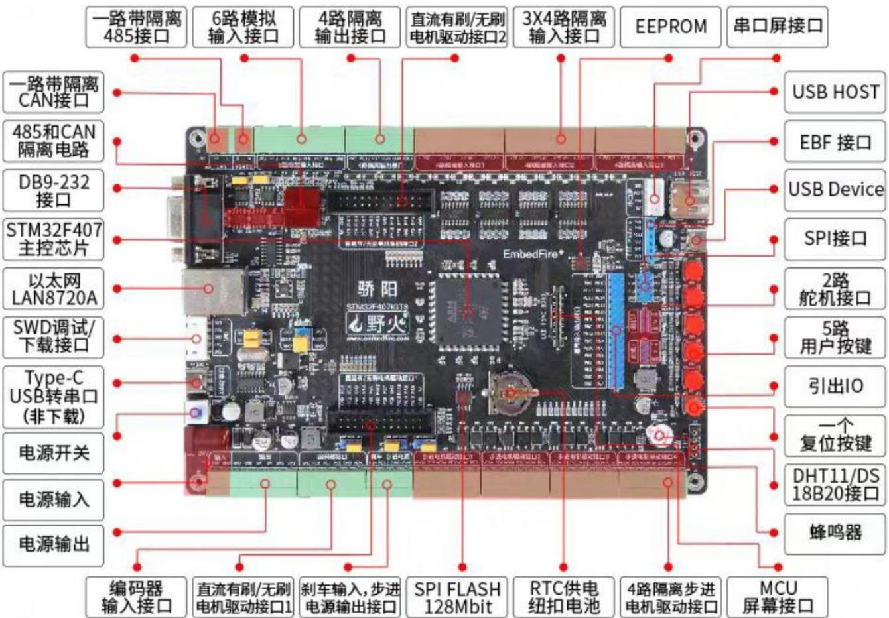

图 2.3-1 骄阳电机开发板硬件资源图

## 2.4 骄阳电机开发板硬件详细说明

## 2.4.1 电源输入和电源输出

DC12~24V 电源输入有 2 种方式，JACK1 和电源输入输出接口（J1）7、8 脚，供电范围 DC12~24V。 开发板板载了一个外部电源输入口（JACK1），采用标准的直流电源插座。开发板板载了 DC-DC 芯 片，用于给开发板提供高效、稳定的 5V/3A 电源。由于采用了 DC-DC 芯片，所以开发板的供电范围比较 宽，不过建议开发板使用过程中请使用开发板配套电源，尽量避免使用其他规格的电源，以免损坏开发 板。在耗电比较大的情况下，比如用到 3.2寸屏/4.3寸屏/网口的时候，建议使用外部电源供电，可以提供 足够的电流给开发板使用。 

电源输入输出接口（J1）引出5V和3.3V针脚，可对外供电。 

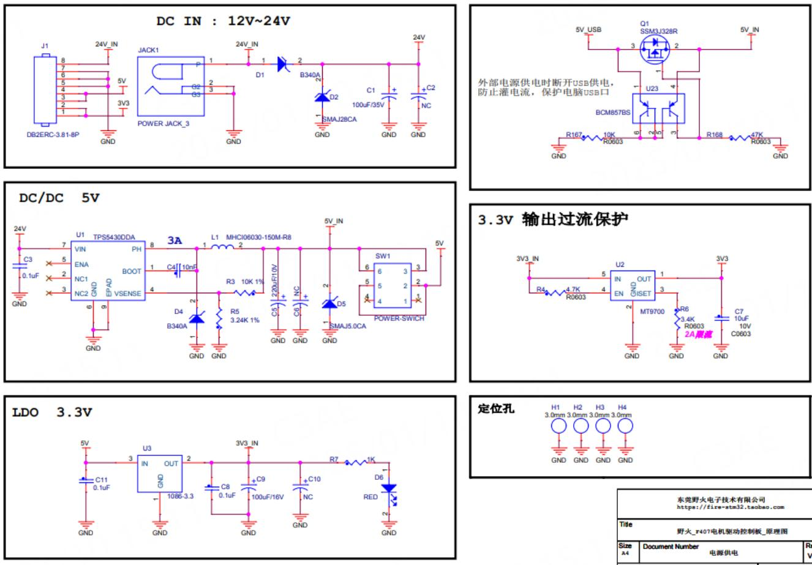

图 2.4-1 电源电路图

## 2.4.2 电源开关

这是开发板板载的电源开关（SW1）。该开关用于控制整个开发板的供电，如果切断，则整个开发 板都将断电，电源指示灯（D6）会随着此开关的状态而亮灭。 

## 2.4.3 编码器输入接口

这是开发板板载电机编码器输入接口（J38），1组编码器（包含 A 相、B 相和 Z相），因为不同的 电机编码器供电有差异，我们预留 2 种供电方式：板载 5V 和电源输入 24V，用户可根据电机参数选择合 适的电压，默认使用5V，通过编码器供电跳帽选择接口（J37）选择供电。 

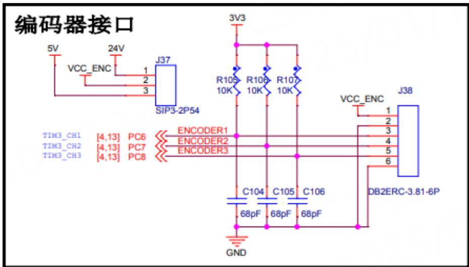

图 2.4-2编码器接口原理图

## 2.4.4 直流有刷/无刷电机驱动接口

开发板板载 2 个直流有刷/无刷电机驱动接口，直流有刷/无刷电机驱动接口 1（J35）和直流有刷/无 刷电机驱动接口 2（J36），规格为 2*12P 的 2.54 间距直脚牛角座，这个是专用接口，可通过一根 24P 专 用排线连接野火直流有刷无刷驱动板或者野火直流无刷驱动板，从而驱动直流无刷电机、直流有刷电机 或永磁同步电机。 

ADC 采集引脚上接了0.1uF 电容，这个是用来滤除信号上的高频杂波，保证采集的信号更准确。 

接口每一路包含3 相编码器信号(或可用作3 相霍尔传器信号) 、3 路电流信号、驱动器总电压采集信 号、 驱动器电流采集信号(或可用作温度采集)、3 路向电动势信号、3 路互补定时器（6 路 PWM）信号以 及停机信号。从 MCU外设的角度来说，每一路需要用到 3~4 组定时器，8 路 ADC 以及一个通用 IO，那 么 2 路就需要 6~7 组定时器，16 路 ADC。经过我们对 IO 完全充分的分配，做到了 7 组定时器和 16 路 ADC完全独立，互不干扰，所以我们可以同时使用2 路直流无刷驱动板。 

如果连接直流驱动板，在闭环情况下则只需要用到 相编码器信号、 路 、 路互补定时器信号 以及停机信号即可。 

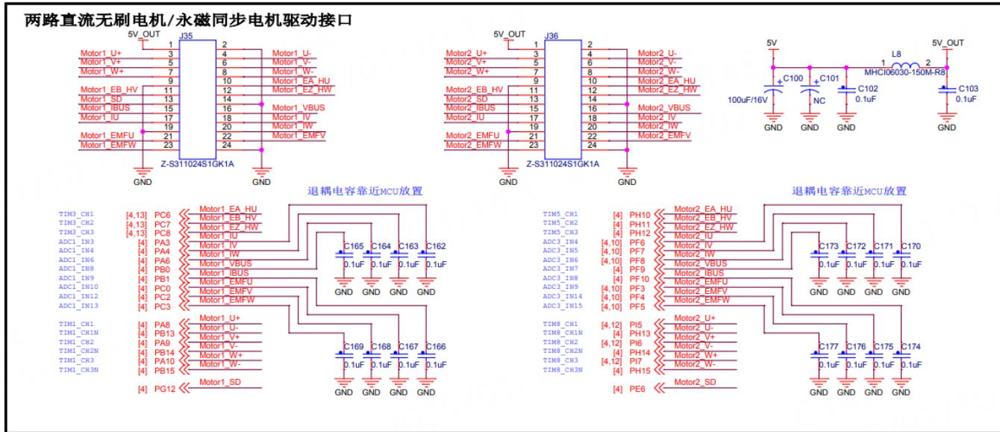

图 2.4-3直流有刷/无刷电机驱动接口原理图

## 2.4.5 刹车输入，步进电源输出接口

这是开发板板载的刹车输入和步进电机电源输出接口（J39），包含了 2 个高级定时器的刹车输入引 脚 TIM1_BKIN(PB12)和 TIM8_BKIN(PI4)通过这个接口可直接关断定时器 PWM 输出，从而关断驱动器。 步进电源输出接口可外接电源(VCC_SMD,GND_SM)，然后通过 J27、J23 跳帽，将外接电源输出给步进 电机供电。（见2.5开发板底板使用说明） 

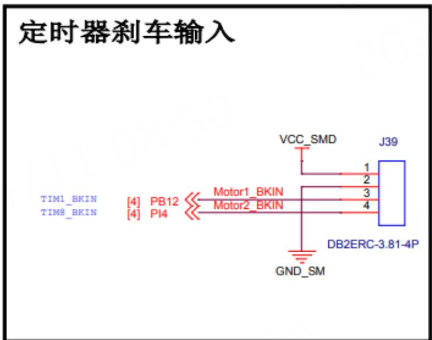

图 2.4-4刹车输入和步进电机电源输出接口原理图

## 2.4.6 SPI FLASH

这是电机开发板外扩的 SPI FLASH 芯片（U5），容量为 128Mbit，也就是 16M 字节，可用于存储字 库和其他用户数据，满足大容量数据存储要求。 

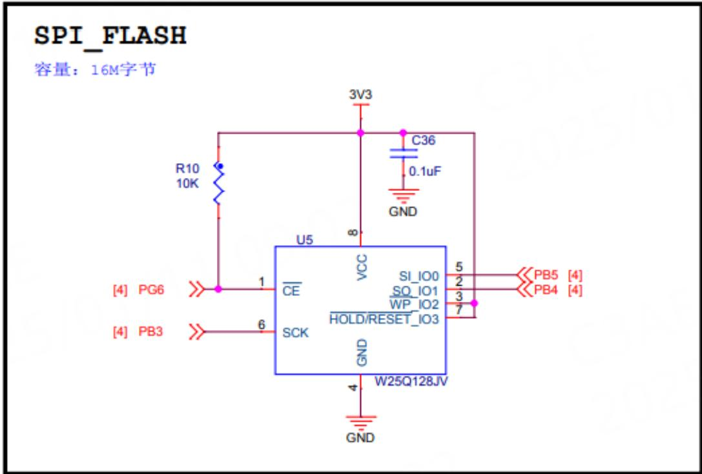

图 2.4-5 SPI FLASH 原理图

## 2.4.7 RTC 供电纽扣电池座

这是 STM32 后备区域的供电接口(CN1)，可安装 CR1220 电池（默认安装了），可以用来给 STM32 的后备区域提供能量，在外部电源断电的时候，维持后备区域数据的存储，以及RTC 的运行。 

图 2.4-6 RTC 供电原理图

## 2.4.8 4路隔离步进电机驱动接口

这是开发板板载的 路（ 、 、 、 ）带光耦隔离的步进电机驱动器接口，接口信号采用共 阳极接法，信号供电支持外接电源，默认使用板载5V。 

4 路步进电机驱动器接口完全独立，互不影响，其中 ENA 使能信号和 DIR 方向信号使用通用光耦 EL357N 隔离，PUL 脉冲信号则使用高速光耦 TLP2362 隔离。我们电机开发板虽然只留出 4 路步进电机 驱动器接口，并不是说开发板只能驱动 4 路步进电机。另外，因为步进电机驱动器接口可以兼容脉冲型 伺服电机驱动器接口，所以这些接口可以用来驱动伺服电机器。可以看到驱动器信号供电为 VCOM 和 

SCOM，开发板预留了供电选择接口（J23）和共地选择接口（J27），可使用板载 5V 电源或者外接电源 （≤5.5V，因为 TLP2362供电电压不能超过 5.5V），默认使用板载 5V 电源。需要注意的是，MCU 使用 NPN 方式驱动光耦（EL357N 和 TLP2362），所以步进驱动器接口信号，我们采用共阳模式，即 PUL+ 、 ENA+、DIR+接到电源 VCOM，对应的 PUL- 、ENA-、DIR-信号就接到光耦的输出引脚。 

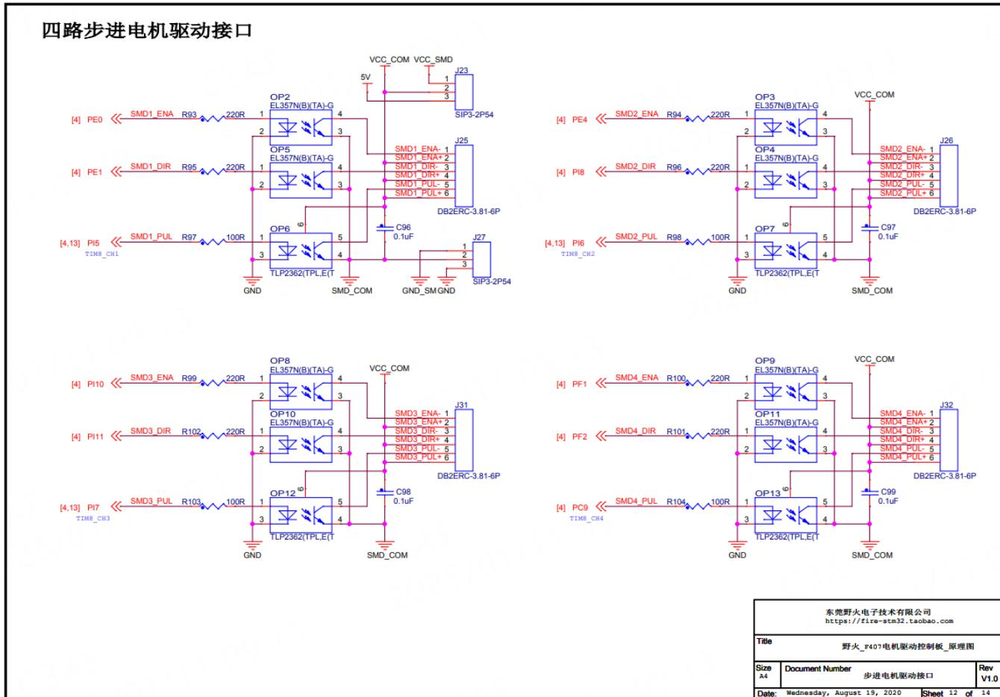

图 2.4-74路隔离步进电机驱动接口原理图

## 2.4.9 MCU 屏幕接口

这是开发板板载的 MCU屏幕接口，1路 FPC，0.5MM间隔，该接口兼容野火电机板配套的 3.2寸和 4.3寸屏（MCU 屏），触摸屏背光信号选用TIM引脚，可控制屏幕亮度，支持电阻/电容触摸功能。 

3.2寸液晶屏接口与开发板的接口需要使用转接板和同面的排线连接。 

4.3寸液晶屏接口与开发板的接口也可以使用 转接板 和 同面的排线 连接；或者不用转接板，但需要 异面的排线连接。 

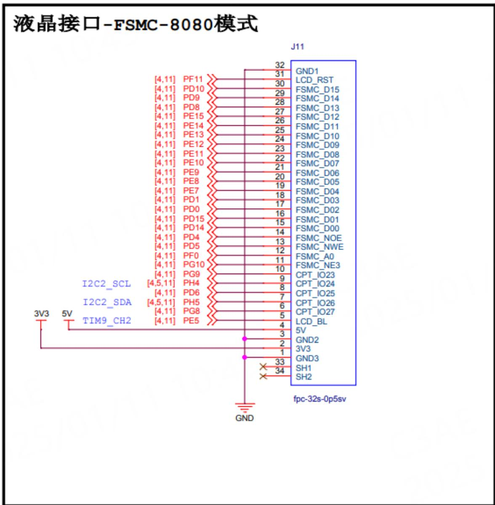

图 2.4-8MCU屏幕接口原理图

## 2.4.10 蜂鸣器

开发板板载的有源蜂鸣器（PZ1），是一种带有内部振荡电路的蜂鸣器。它可以直接通过给予电压信 号来产生声音，无需外部电路的支持。有源蜂鸣器适用于在开发板上提供简单的声音指示，例如用于提 醒、警报、报警等功能。 

图中 Q4 是用来扩流，R45 则是一个下拉电阻，避免 MCU 复位的时候，蜂鸣器可能发声的现象， D10二极管的作用是防止电流断开时产生尖峰电压，BEEP 信号直接连接在MCU 的PG7上面。 

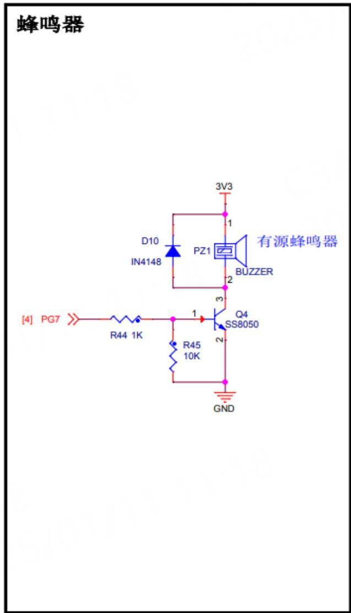

图2.4-9蜂鸣器原理图

## 2.4.11 DHT11/DS18B20 接口

这是开发板的一个复用接口，可以用来接 DS18B20 等数字温度传感器，也可以用来接 DHT11 这样 的数字温湿度传感器，实现一个接口两个功能。不用的时候，大家可以拆下上面的传感器，放到其他地 方去用，使用上是十分方便灵活的。 

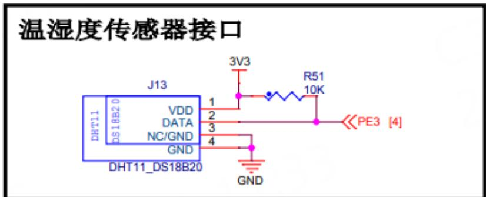

图 2.4-10 DHT11/DS18B20 接口原理图

## 2.4.12 按键

开发板板载1个复位按键和 5个用户按键。 

复位按键用于手动复位 STM32，并联电容实现硬件消抖，默认上拉，按下按键后低电平。 

5 个用户按键可以用于人机交互的输入，并联电容实现硬件消抖，这 5 个按键是直接连接在 STM32 的 IO口上的，默认下拉，按下按键后高电平。 

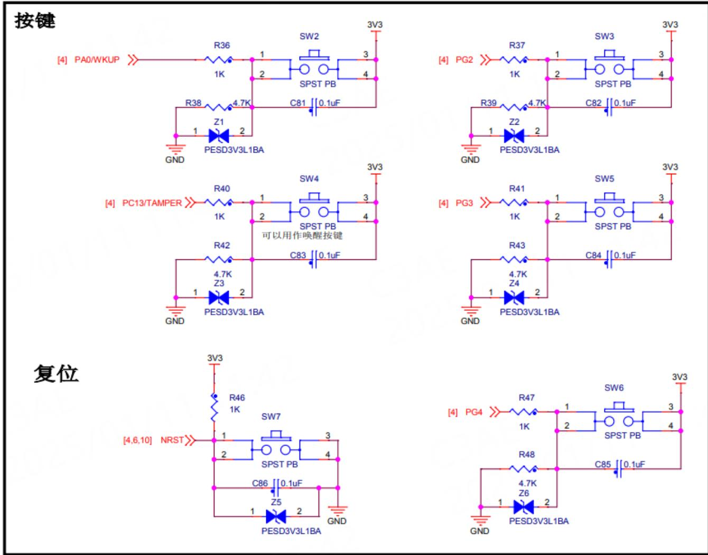

图 2.4-11 按键原理图

## 2.4.13 引出 IO

开发板的通用输入输出接口引出了芯片的部分 IO 脚和 5V、3.3V 以及 GND，与 MCU 屏幕接口所用 脚相同，所以不能同时使用。 

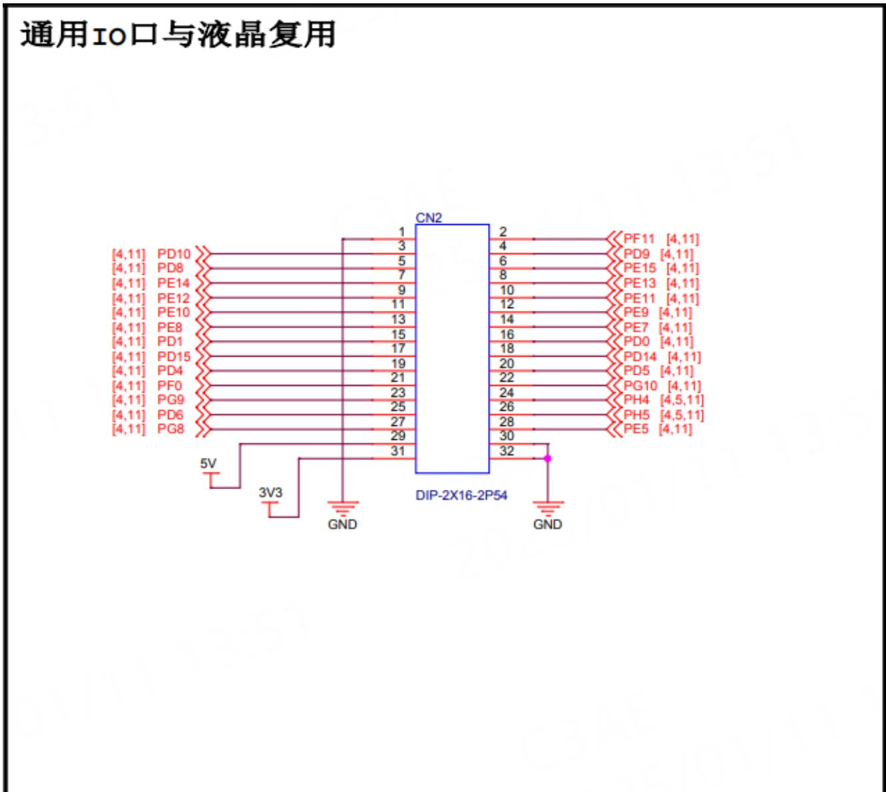

图2.4-12通用输入输出接口原理图

## 2.4.14 2 路舵机接口

开发板板载了2路舵机接口，接口采用 1*3P 的 2.54 排针，5V供电，可以直插舵机，所连的 IO脚并 不是直接控制舵机，而是经过电平转换来控制舵机，这样隔离了 IO，同时使得 IO 输出的 3.3V 可以控制 5V 电平的舵机。电平转换电路实际就是一个反向器，因为是反向器，所以控制电平需要反过来，比如要 给舵机一个2ms 高电平，周期 20ms 的信号，控制信号实际需要输出2ms 低电平+18ms 高电平。 

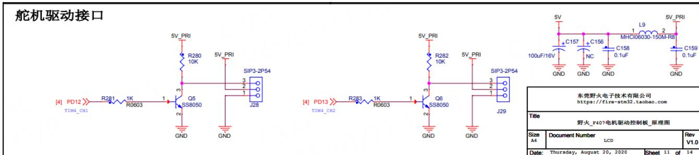

图2.4-132路舵机驱动接口原理图

## 2.4.15 SPI 接口

开发板板载了1路 SPI 接口， 接口采用 2*4P 的 2.54 排针，可外接SPI通讯的模块，通过2*4P排线 可直接接入野火24位ADC模块，野火16位DAC模块，实现模拟信号的输入和输出。 

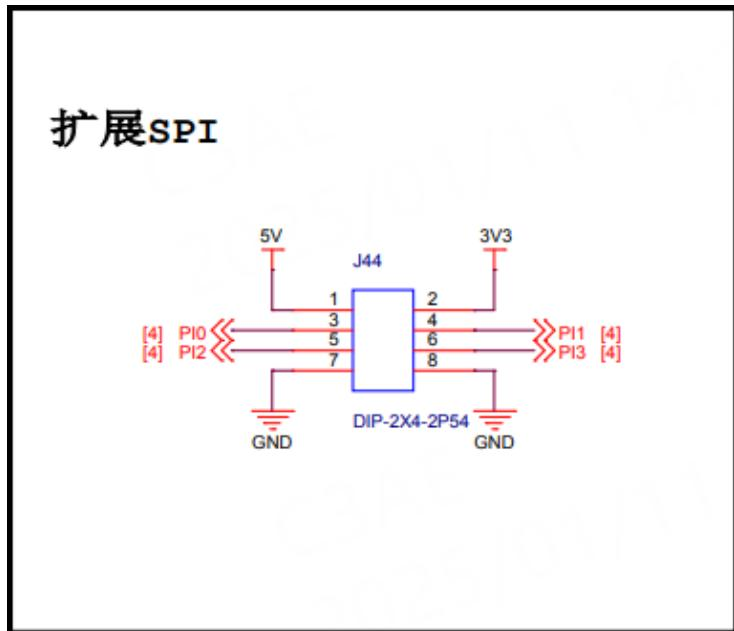

图 2.4-14 SPI 接口原理图

## 2.4.16 USB Device

这是开发板板载的一个 Type C USB 头，用于 USB 从机通信，一般用于 STM32 与电脑的 USB 通信。 开发板总共板载了 2 个Type C USB 头，一个用于STM32 内带的USB；另外一个用于USB 转串口，连接 CH340芯片。开发板也可以通过此接口供电。 

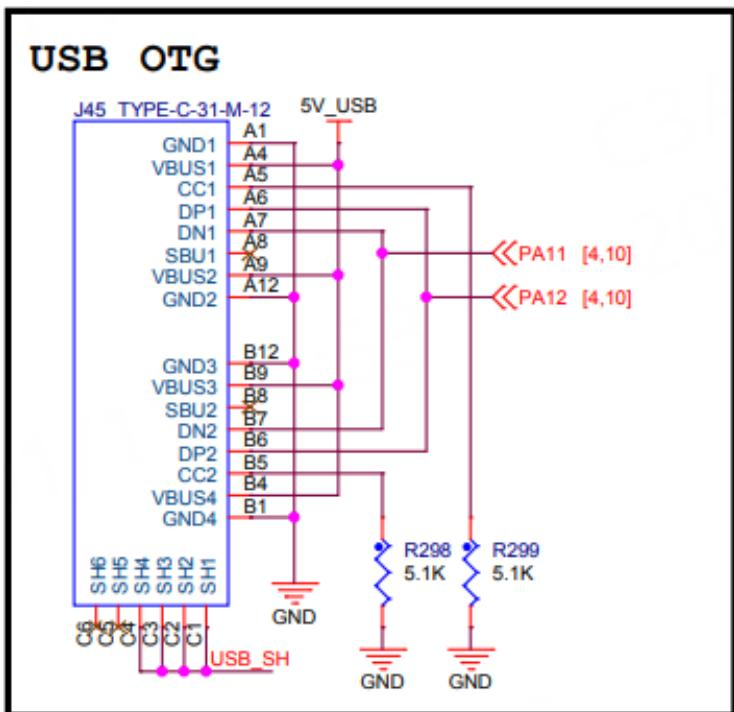

图 2.4-15 USB Device 原理图

## 2.4.17 EBF 模块接口

这是野火自定义的单独引出部分 IO 接口，接口采用 1*6P 的 2.54 排母，可以连接串口通讯类的模块。 

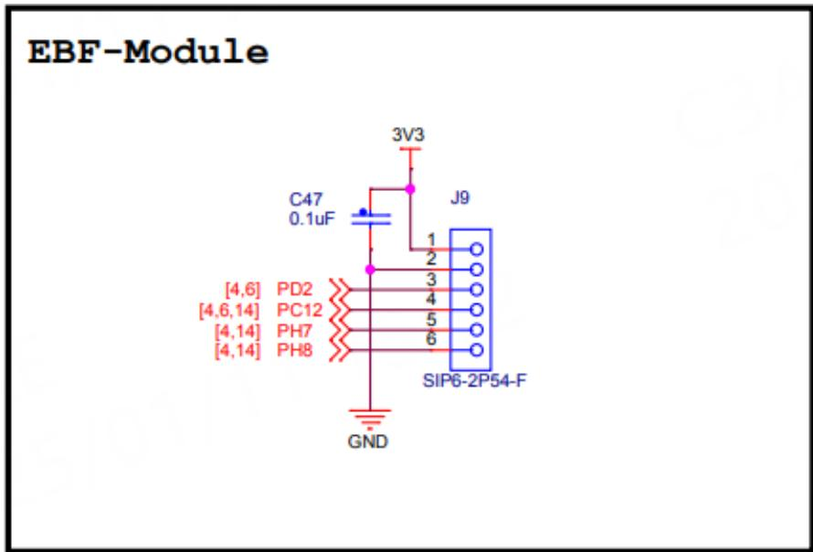

图 2.4-16 EBF 模块接口原理图

## 2.4.18 USB HOST

这是开发板板载的一个 USB 主机接口（USB-A 座），芯片的 USB 是支持 HOST的，所以我们可以 通过这个 USB-A 座来连接USB从设备，从而实现 USB 主机功能。该接口可以对从设备供电，供电电源 来自 5V_HOST。 

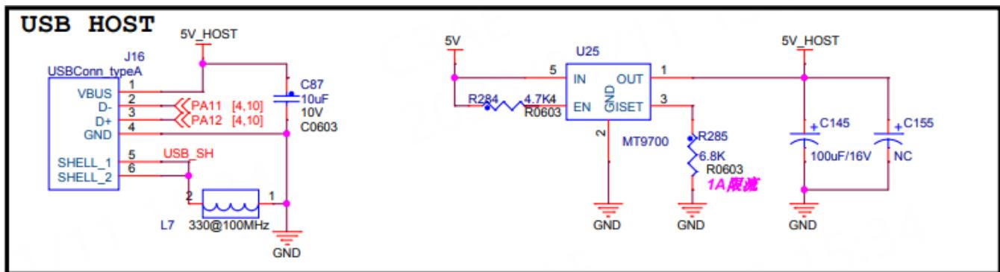

图 2.4-17 USB HOST 原理图

## 2.4.19 串口屏接口

开发板中板载了 1 个串口屏接口，与 EBF 模块接口引脚共用，所以两者不能同时使用，因为串口屏 的特有优势，已被大量的用户使用，所以我们预留这个接口。 

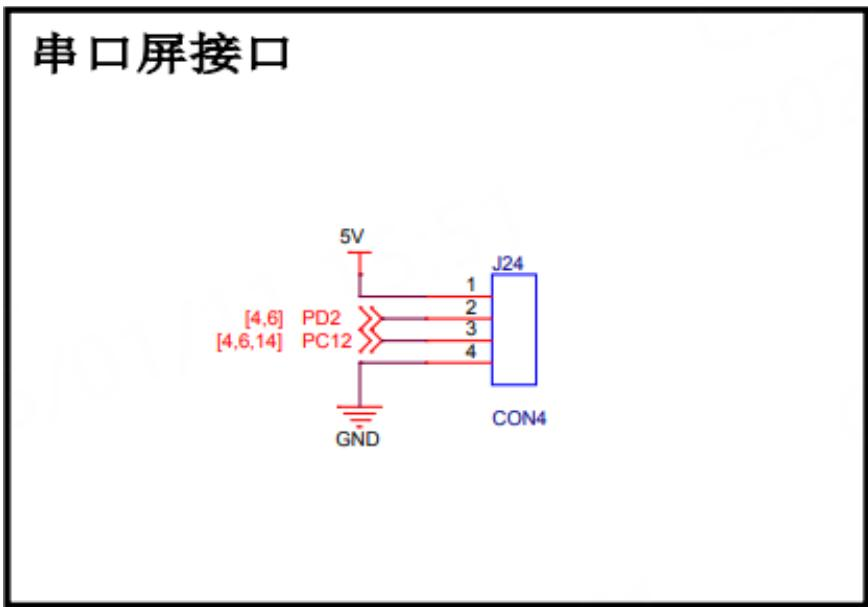

图 2.4-18串口屏接口原理图

## 2.4.20 EEPROM

这是开发板板载的 EEPROM 芯片，容量为 2Kb，也就是 256 字节。通过 I2C与其进行通信，可读可 写，具有掉电数据不丢失的特性，可用于存储一些掉电不能丢失的重要数据。 

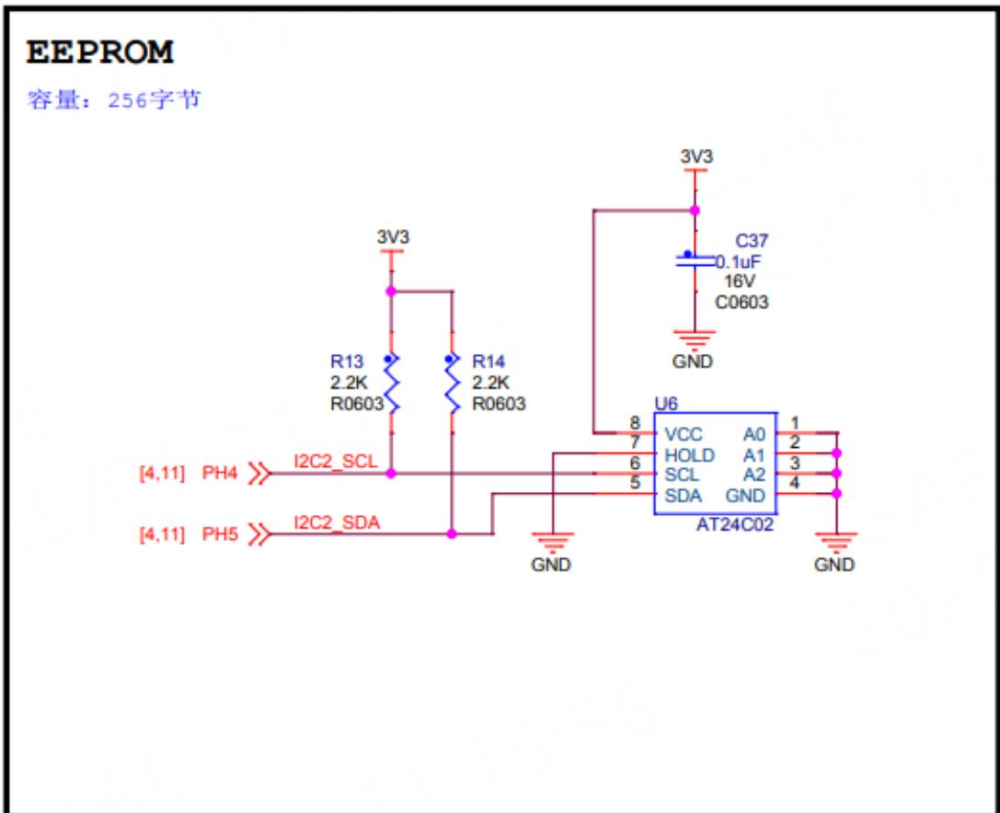

图 2.4-19 EEPROM 原理图

## 2.4.21 3×4 路隔离输入接口

开发板板载的带光耦隔离的通用输入接口，总共 3x4 路（J40、J41、J43），可方便用于检测开关量 信号，比如光电传感器，限位开关信号等。 

光耦输入端子全部引出，方便用户使用不同的接法，串接了 2.2K 电阻可保证检测 24V 以内的开关信 号，并联了开关二极管，用于输入信号防反接。光耦的输入端则连接到 MCU 的 IO 上，并使用 4.7K 电阻 上拉（默认高电平），当输入信号有效时，变为低电平。开发板明确标明了输入信号正负极，按丝印接 入即可。 

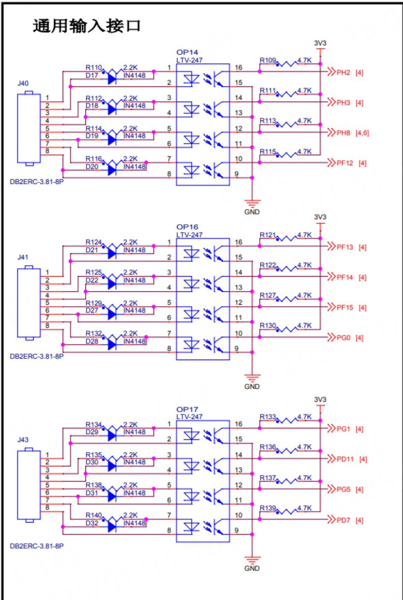

图 2.4-203×4路隔离输入接口原理图

## 2.4.22 4 路隔离输出接口

开发板板载的带光耦隔离的通用输出接口，总共 4 路，可方便用于控制外部开关量信号，比如传感 器使能信号等。 

光耦输入采用共阳极接法，限流电阻 510R，光耦输入负极接 MCU的 IO上，推挽输出低电平可以让 光耦导通。光耦输出是共阴极接法，电压由外部提供（≤24V），默认 4.7K 上拉。当光耦输入低电平时， 输出低电平。并联了开关二极管，用于外接电源防反接。COM 为外接电源负极，VOUT 为外接电源正极， 按丝印接入即可。 

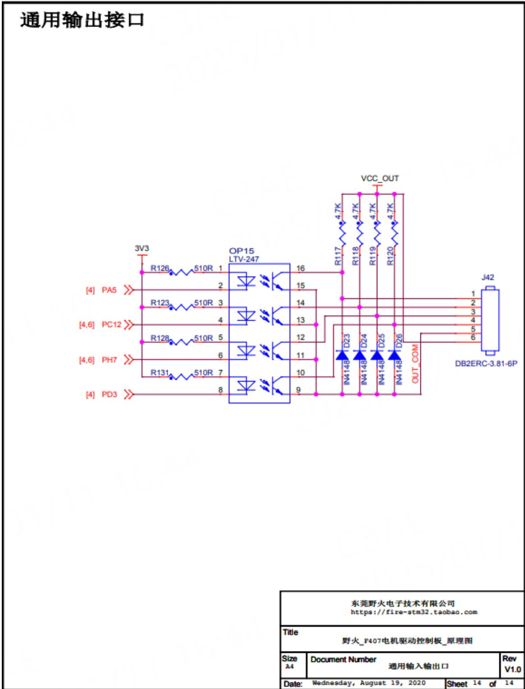

图2.4-214路隔离输出接口原理图

## 2.4.23 6 路模拟输入接口

这是开发板板载一组模拟量采集接口以及一组 3.3V 供电接口，支持同时采集 6 路模拟信号，因为接 口信号通过 100R 电阻直接接到 MCU 的 ADC，所以接口信号不能超过 3.3V。6路模拟输入接口和直流有 刷/无刷驱动器接口2的部分引脚共用，所以不能同时使用。 

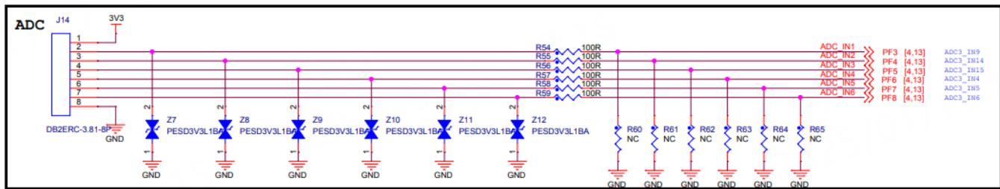

图2.4-226路模拟输入接口原理图

## 2.4.24 1 路带隔离 485 接口

开发板板载 1路带隔离 485接口，通过 2 个端口和外部 485 设备连接。RS485 通信的时候，必须 A 接 A，B 接B，否则可能通信不正常！J67跳帽可用于选择 485的传输末端是否使用终端电阻（120Ω）。 

RS485 电平不能直接连接到 STM32，需要电平转换芯片。这里我们使用 GM485E 来做 485 电平转换， 其中 R23 为终端匹配电阻，而 R22(下拉)，R24(上拉)，则是两个偏置电阻，以保证静默状态（A-H ; B-L） 时，485 总线表现逻辑1。 

利用光耦+数字隔离实现 485 电路隔离，MCU 的串口收发脚通过双通道数字隔离器进行隔离，用作 485收发使能的IO脚通过光电耦合器进行隔离，以保护芯片 IO，从而保护芯片。 

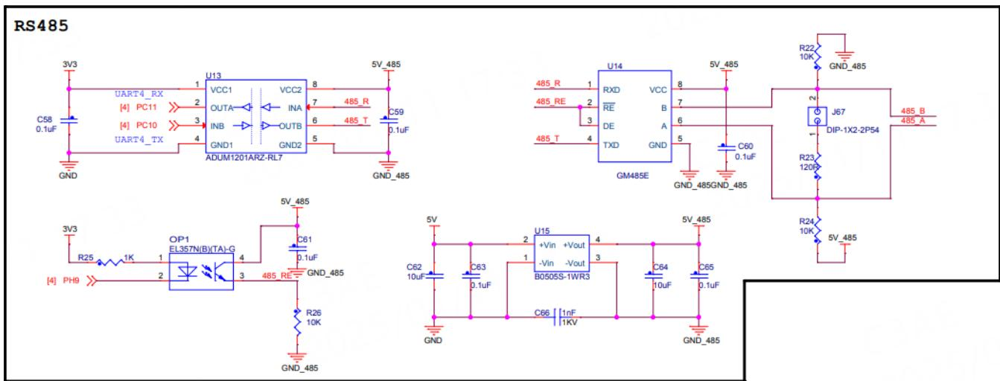

图 2.4-23 1 路带隔离 485 接口原理图

## 2.4.25 1 路带隔离 CAN 接口

开发板板载1路带隔离CAN接口，通过 2 个端口和外部 CAN 设备连接。CAN 通信的时候，必须 H 接 H，L 接 L，否则可能通信不正常！J66跳帽可用于选择 CAN的传输末端是否使用终端电阻（120Ω）。 

CAN总线电平不能直接连接到 STM32，需要电平转换芯片。这里我们使用TJA1042T/3 来做 CAN 电 平转换。 

利用数字隔离实现 CAN电路隔离，MCU的 CAN收发脚通过双通道数字隔离器进行隔离，以保护芯 片 IO，从而保护芯片。 

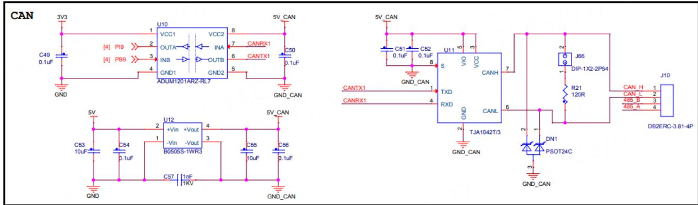

图 2.4-24 1路带隔离 CAN接口原理图

## 2.4.26 1 路 RS232 接口(母)

开发板板载1路RS232 接口，通过一个标准的 DB9 母头和外部的串口连接。RS232电平不能直接连 接到 STM32，所以需要一个电平转换芯片，这里我们选择的是 MAX3232 来做电平转接。通过这个接口， 我们可以连接带有串口的电脑或者其他设备，实现串口通信。 

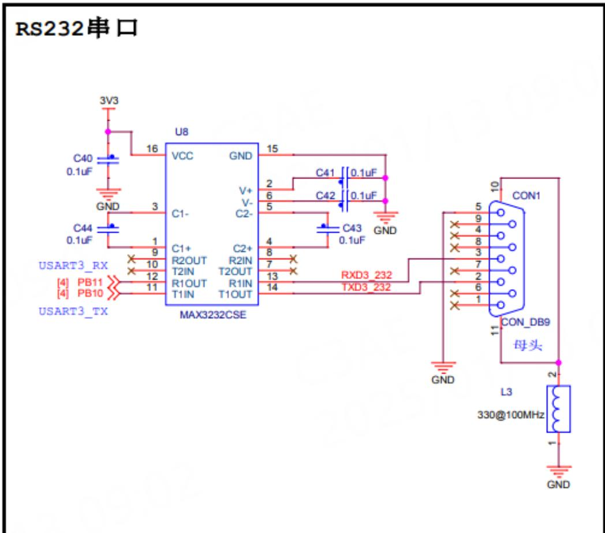

图 2.4-25 1 路 RS232 接口原理图

## 2.4.27 STM32F407 主控芯片

开发板的主控芯片，型号为 STM32F407IGT6。该芯片集成 FPU 和 DSP 指令，并具有 1024KB FLASH、192KB SRAM、12 个 16 位定时器、2 个 32 位定时器、2 个 DMA 控制器（共 16 个通道）、3 个 SPI、2 个全双工 I2S、3 个 I2C、6 个串口、2 个 USB（支持 HOST/SLAVE）、2 个 CAN、3 个 12 位 ADC、2 个 12 位 DAC、1 个 RTC（带日历功能）、1 个 SDIO 接口、1 个 FSMC 接口、1 个 10/100M 以 太网 MAC 控制器、1 个摄像头接口、1个硬件随机数生成器以及 140 个通用IO 口。 

## 2.4.28 以太网接口

开发板板载 1路以太网接口，可以用来连接网线，实现网络通信功能。因为 STM32F4 内部自带网络 MAC 控制器，所以只需要加一个 PHY 芯片，即可实现网络通信功能，这里我们使用 LAN8720A 作为网 络 PHY 芯片，该芯片采用 RMII 接口与 STM32F4 通信，板载一款集成了网络变压器和LED灯的RJ45头， 一起实现一个10M/100M 自适应网卡。 

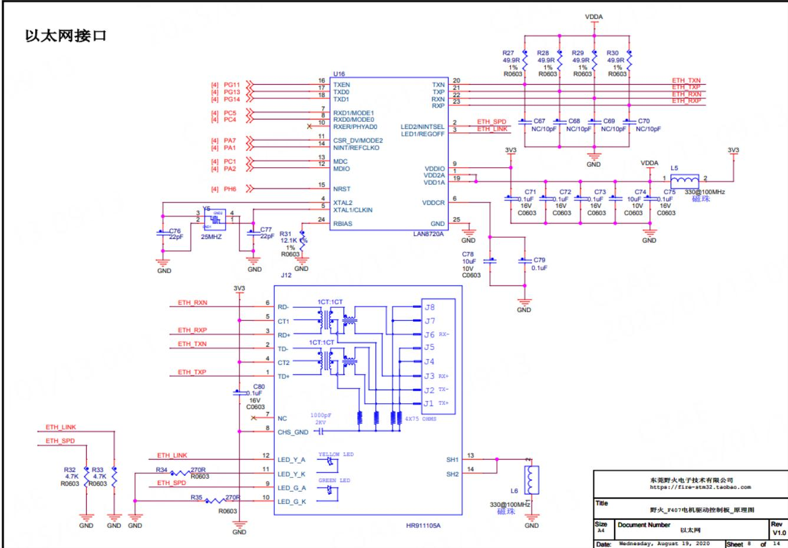

图2.4-26以太网原理图

## 2.4.29 SWD 接口

这是开发板板载的 下载调试接口，因为 使用方便还节省 ，所以我们使用这种接口来对 MCU 进行下载和仿真调试。（注意：如果使用 JLINK、STLINK和 ULINK等其它支持 SWD模式的，连 接按照 SWD 接法，对照丝印用杜邦线接，NRST 对 RST、SWCLK 对 TCK、 GND 对 GND、SWDIO 对 TMS、3V3 对 VREF） 

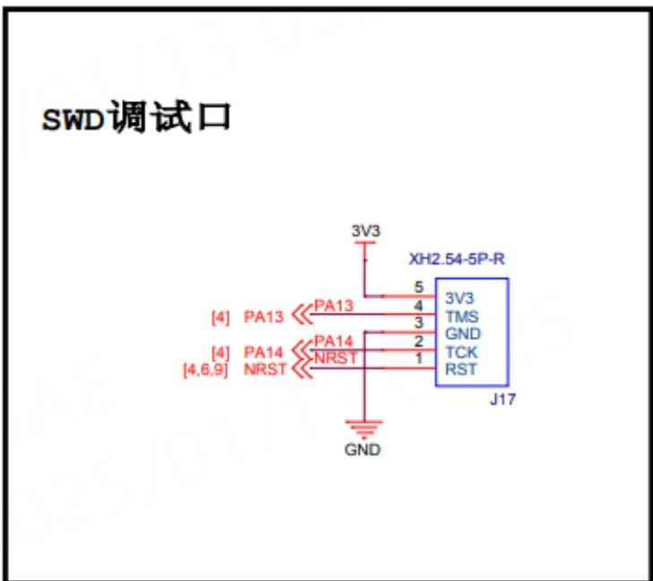

图 2.4-27 SWD 接口原理图

## 2.4.30 USB 转串口(非下载)

这是开发板板载的一个 Type C USB 头，通过 USB 连接 CH340 芯片，从而实现 USB 转 TTL 串口， 开发板也可以通过此接口供电。串口所连接的引脚不具有串口下载功能，另外，当我们拔掉跳线帽之后， 可以将其当作一个USB 转串口模块来使用（TypeC 口连接电脑即可，并不需要给开发板上电）。 

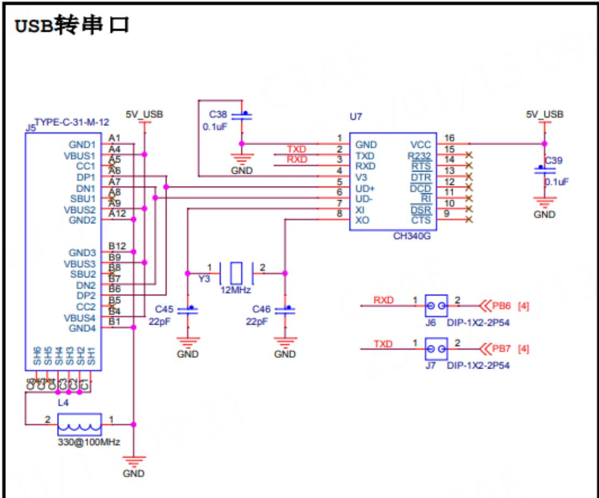

图 2.4-28 USB 转串口原理图

## 2.5 开发板底板使用说明

## 2.5.1 引脚指南

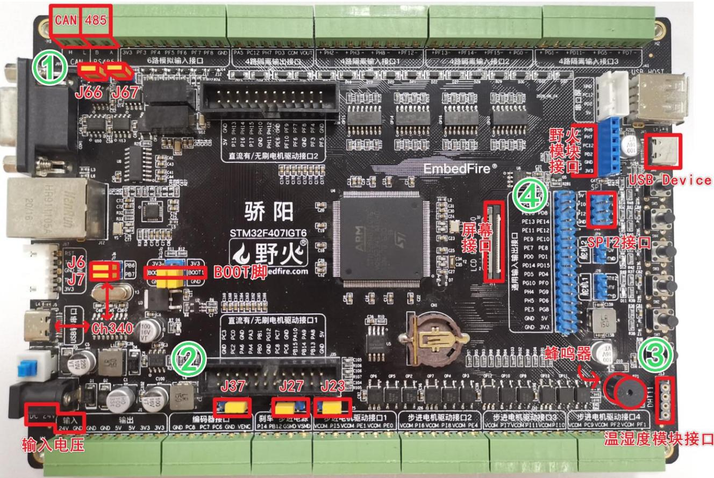

## ① CAN、485、232

跳帽可用于选择 的传输末端是否使用终端电阻。 在底板接到了 和 ，不能通 过跳帽更改。 

2.J67 跳帽可用于选择 485 的传输末端是否使用终端电阻。485 在底板接到了 PC11 和 PC10 （UART4），不能通过跳帽更改。 

3.232在底板接到了 PB11和 PB10（USRAT3），不能通过跳帽更改。 

## ② USB转串口与编码器和步进电机的相关跳帽选择

1.在 CH340的上方，通过 J6、J7跳帽将 USART1的输入输出引脚与 CH340的输出输入引脚连接起来， 使得此处的 Type-C连接电脑后使用的是串口1的输入输出能力。 

2.J37跳帽可用于选择编码器接口的输入电压为24V或 5V。 

3.J27 跳帽和 J23 跳帽可用于配合选择步进电机接口电源的负极是内部（GND）还是外部（GSMD） 以及选择步进电机的正极是内部（5V）还是外部（VSMD）。 

## ③ 蜂鸣器及温湿度接口

1.蜂鸣器在底板与PG7相连，当 G7脚置高时，蜂鸣器会响。 

2.此温湿度接口可接 DTH11/DS18B12模块。简要来说，DTH11有洞的一面朝着板子外面，插在接口 上；DS18B12突出的一面朝板子外面，插入接口的小圆弧包含的三个脚位置。 

## ④ 屏幕接口、野火模块接口和 USB Device

1.此屏幕接口可以使用32P屏幕排线来连接对应的LCD屏幕。 

2.EBF Module接口可以用于接野火的蓝牙、GPS、SPI 接口的 OLED屏幕。 

3.USB Device 为 USB 从机，目前仅用于 HAL 库开发指南中 USB—使用外部 FLASH 模拟 U 盘例程。 

## 2.5.2 具体常用芯片位置图

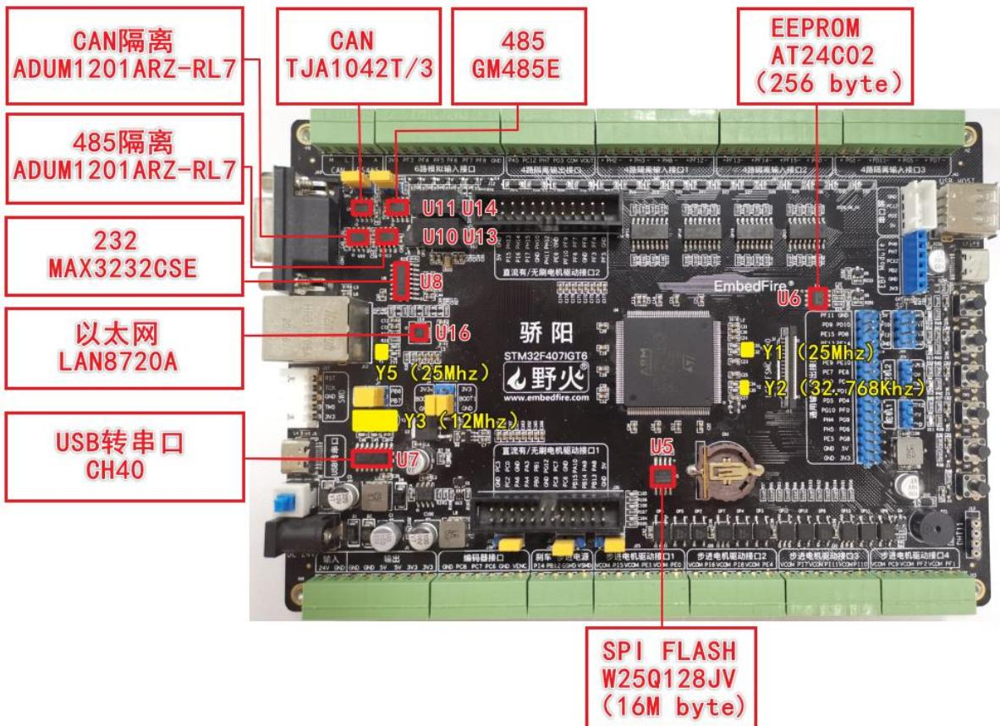

红色方框为芯片，黄色方块为晶振。 

目前部分板子上装的是内置晶振的 ，它与需要外置晶振的 功能一致。因此，若是发 现旁边的晶振位没有焊接晶振（即上方图 Y3位置），不是因为少焊了晶振，而是晶振已经内置到 CH340 内部了。 

## 2.5.3 关于隔离输入输出口的使用

隔离接口只能做单向的输入或输出，根据板子上标的使用，也就是说，标注为隔离输入口的只能做 输入，标注为隔离输出口的只能做输出。 隔离输入的极限输入电流 50mA，50mA*2.2kΩ=110V，极限输 入电压 110V。下面是隔离输入和输出的接线介绍。 

## 隔离输入

隔离输入应用思路为外部设备可能需要一个比较大的供电电压，输出的信号电压也与供电有关，将 信号经过隔离输入后可以由单片机引脚接收。 

实物连接图使用的是骄阳开发板进行连接，其他板原理一致，传感器为 NPN 接近开关，引脚定义和 对应颜色如下图所示，当红色的传感器头感应到金属时，对应的 灯会亮，再次感应，则会熄灭。 

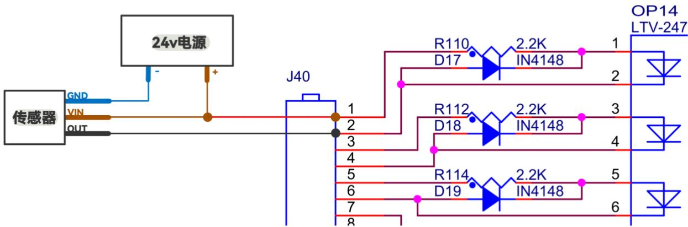

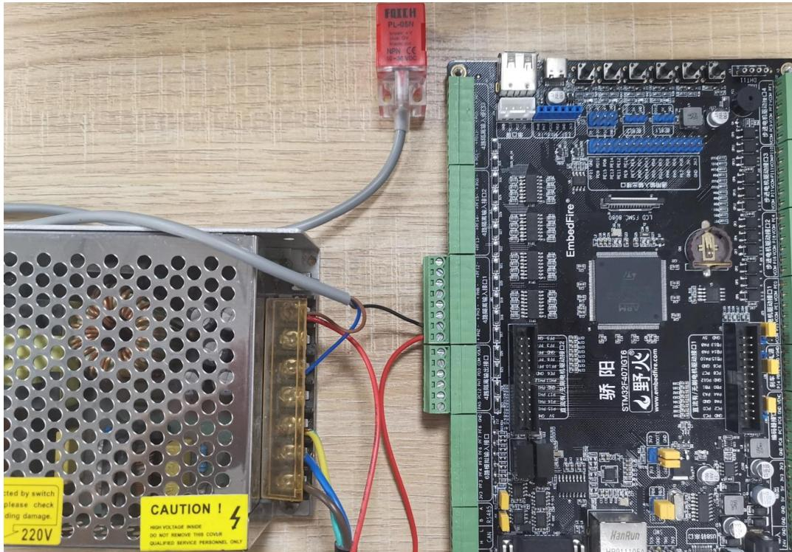

## 隔离输出

隔离输出应用思路为外部设备需要一个比较大的电压信号，前提需要有这样一个额外的对应电压信 号，将电压信号接到隔离输出的 VOUT，既是转为由单片机控制通断输出该信号给设备。 

下面实验为从另一个开发板上取 5V电压信号来控制继电器上的触发引脚。 

实物连接图使用的是骄阳开发板进行连接，其他板原理一致，为了方便观察线的连接，这边只使用 了 PH7连接到继电器的IN1脚处，在实际使用中则可以用隔离输出的接口与继电器的 INT脚一一对上。 

由于隔离输出端口中有 4.7K 的电阻，继电器的输入端为光耦输入，由 EL817 的芯片手册，IF （Forward current）小于60ma的情况即可，若是5V的驱动力还是不太够的话，可根据情况增大电源电压。 

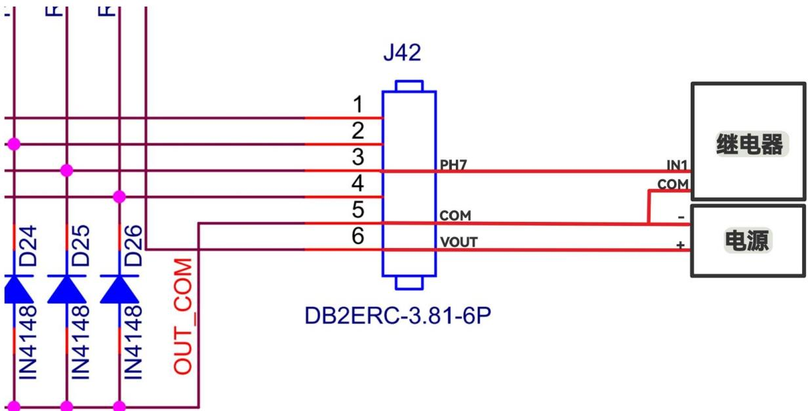

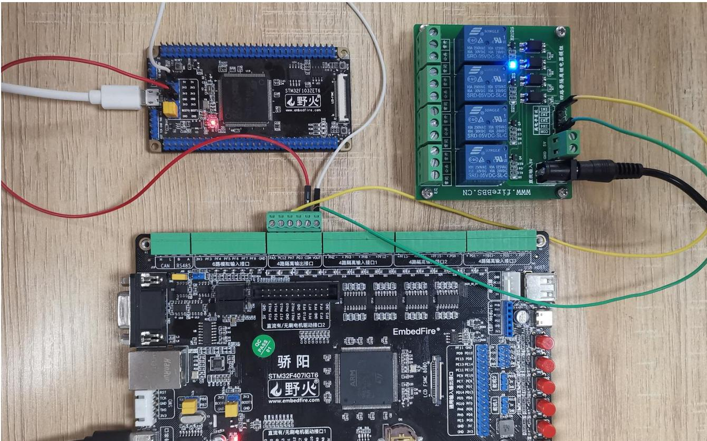
